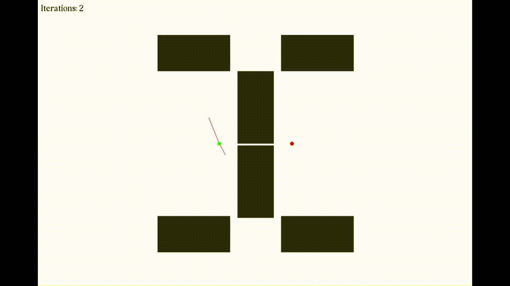

# RRT Playground

## Installation
- [SFML](https://www.sfml-dev.org/)
- [Eigen](https://eigen.tuxfamily.org/index.php?title=Main_Page)
- [CMake](https://cmake.org/): Version > 3.10
```
$ sudo apt-get install libsfml-dev libeigen3-dev
```

## Results
### RRT


### RRT*


### Anytime RRT


### Informed RRT*


## References
[[1]](http://msl.cs.uiuc.edu/~lavalle/papers/Lav98c.pdf) Steven M. LaValle, "Rapidly-exploring random trees: A new tool for path planning," Technical Report. Computer Science Department, Iowa State University (TR 98–11).

[[2]](https://arxiv.org/pdf/1005.0416.pdf) S. Karaman and E. Frazzoli, "Incremental Sampling-based Algorithms for Optimal Motion Planning," arXiv:1005.0416, May. 2010.

[[3]](https://ieeexplore.ieee.org/document/6942976?arnumber=6942976) J. D. Gammell, S. S. Srinivasa, and T. D. Barfoot, “Informed RRT*: Optimal sampling-based path planning focused via direct sampling of an admissible ellipsoidal heuristic,” in 2014 IEEE/RSJ International Conference on Intelligent Robots and Systems, 2014, pp. 2997–3004.